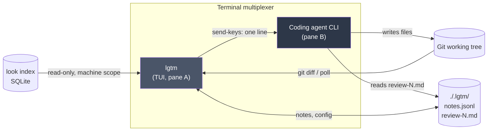
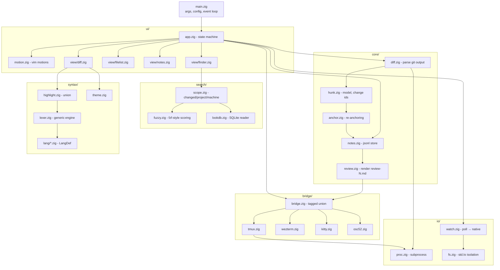
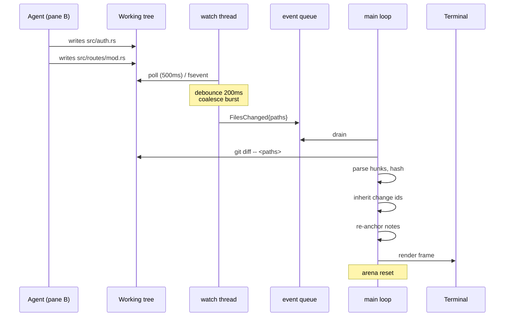
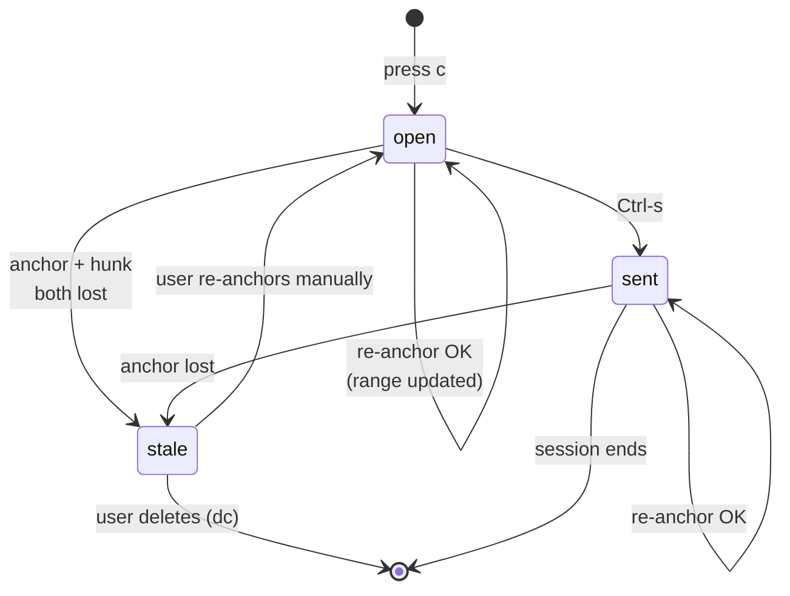

# `lgtm` - Architecture

**Language:** Zig 0.16.0 (pinned)
**Companion doc:** SPEC.md
**Status:** draft v0.1

---

## 1. Shape of the thing

`lgtm` is a single-binary TUI with no daemon, no server, and no background service. It reads three things it does not own - the git working tree, the `look` index, and the terminal - and writes to exactly two places: its own `.lgtm/` directory and the agent's input via the multiplexer.



Two properties fall out of this and are worth protecting:

- **`lgtm` is agent-agnostic.** It never speaks to the agent's API, only to its input box. Any agent that reads files and accepts typed text works, including ones that do not exist yet.
- **`lgtm` is stateless with respect to the repo.** Kill it, restart it, and the only thing you lose is scroll position. All durable state is in `.lgtm/`.

---

## 2. Module graph



**Dependency rule:** `core/` knows nothing about `ui/`, `bridge/`, or the terminal. It is pure data in, data out, and therefore the only part that needs real tests. `ui/` is where correctness is judged by eye.

---

## 3. The main loop

Single-threaded UI, one background thread for watching and indexing. They meet at one mutex-protected queue and nowhere else.



Three rules this diagram encodes:

1. **Debounce lives in the watch thread, not the main loop.** The main loop should never see a burst.
2. **Only changed paths are re-diffed.** `git diff -- <paths>` scales with the agent's edit, not with the repo.
3. **Change-id inheritance runs before re-anchoring**, because anchoring uses `hunk_hash` as its fallback and needs hunks already identified.

---

## 4. Memory strategy

This is the design decision Zig forces you to make explicitly, so make it once and write it down.

| Lifetime | Allocator | Contents |
|---|---|---|
| Process | `DebugAllocator` (debug) / `page_allocator` wrapper (release) | config, bridge handle, highlighter state, SQLite handle |
| Session | GPA-backed `ArrayList` | notes, change-id table, note anchors |
| **Diff generation** | `ArenaAllocator`, **reset on every re-diff** | hunk structs, diff lines, parsed git output |
| Frame | `ArenaAllocator`, reset every render | formatted strings, highlight spans, layout boxes |

The diff arena is the important one. A re-diff throws away everything about the previous diff, which is exactly what an arena is for: no per-hunk frees, no ownership questions, one `arena.reset(.retain_capacity)` and the whole generation is gone. After a few frames it stops calling the OS entirely.

The catch: **notes must not hold pointers into the diff arena.** Notes outlive diffs. They store owned copies of `anchor_hash`, `body`, and `file`, allocated from the session allocator. Any struct that crosses the arena boundary owns its own bytes. Enforce this by making `Note` contain only `[]const u8` fields allocated from `notes.allocator`, never slices handed over from `diff.zig`.

---

## 5. Highlighting: lexer first, tree-sitter as an escape hatch

`lgtm` needs two things from a language, and neither one needs a parse tree:

1. **Token colouring** - a lexer is sufficient.
2. **Enclosing function name for a hunk header** - a lexer plus brace-depth tracking is sufficient.

A lexer is also a *better* fit here than a parser. A hunk is by definition a fragment: unbalanced braces, functions cut off at both ends. Lexers handle fragments naturally; parsers fall into error recovery, which is their slowest path. tree-sitter's real strength - an accurate tree - is largely wasted on a diff viewer.

**One generic lexer, per-language definitions via comptime:**

```zig
const rust = LangDef{
    .line_comment = "//",
    .block_comment = .{ .open = "/*", .close = "*/", .nested = true },
    .strings = &.{ .{ .delim = "\"", .escape = '\\' }, .raw_hash },
    .keywords = &.{ "fn", "let", "impl", "pub", "match", ... },
    .fn_decl = &.{ "fn " },
};
```

Roughly 200–400 lines for the engine plus the first language; ~60 lines of declaration for each language after that.

**Pluggable, so the decision stays reversible:**

```zig
pub const Highlighter = union(enum) {
    lexer: Lexer,
    tree_sitter: TreeSitter,   // not built in v0.1
    plain,
};
```

Selected per language *and* per file size. A language with a lexer uses it; anything else falls back to tree-sitter if linked, otherwise `plain`. The user never sees an unhighlighted screen as a failure - it is just a fallback.

**v0.1 ships three lexers: Rust, Go, Python.** Zero C dependencies for highlighting, ~50 KB of binary, nothing to profile.

**When tree-sitter earns its place.** Its real value is not speed - it is that *other people maintain 100+ grammars*. What exhausts you writing lexers is not Rust or Go, it is JavaScript (`/` is division or a regex literal depending on context), nested string interpolation, raw strings with arbitrary `#` counts, heredocs. If demand for those languages materialises, link tree-sitter behind the `tree_sitter` variant and vendor only the grammars that need it. Note that tree-sitter has real costs of its own: TypeScript/TSX grammars alone add megabytes of parse tables, running `highlights.scm` over a whole file often costs more than the parse itself (bound it with `ts_query_cursor_set_byte_range`), and half-written files trigger error recovery - the slow path.

**Guard rails, applied to any highlighter:**

- Files over 500 KB or 10k lines → `plain`, no tokenising. Shares the threshold logic with the diff summary path.
- Tokenise only the visible range plus a small margin.
- Cache token runs keyed by content hash (LRU, ~32 files). The agent touches six files but usually changes one or two; the rest cost nothing on re-diff. This is the optimisation that matters, not micro-tuning the lexer.

---

## 5b. C dependencies

After the lexer-first decision, exactly one remains.

```zig
const c = @cImport({
    @cInclude("sqlite3.h");
});
```

| Library | Use | Linkage |
|---|---|---|
| sqlite3 | read the `look` index | system lib, or vendored amalgamation |

`tree-sitter` is deferred to v0.3+ and only if language demand justifies it.

`libgit2` is deliberately absent. v0.1 shells out to `git`: less linkage, no version skew, and it inherits the user's git config and worktree handling for free. Revisit only if subprocess latency shows up in a profile.

**The `look` index is read through its SQLite file, not through Rust FFI.** The file format is the interface. The cost is a schema coupling between two codebases in two languages - mitigated by reading a `schema_version` row at startup and degrading Machine scope with a clear message if it does not match a known version. Never fail to start because of it.

---

## 6. The bridge interface

Runtime-selected backends, so this is a tagged union rather than comptime dispatch:

```zig
pub const Bridge = union(enum) {
    tmux: Tmux,
    wezterm: WezTerm,
    kitty: Kitty,
    zellij: Zellij,
    osc52: Osc52,

    pub fn sendText(self: *Bridge, text: []const u8) BridgeError!void { ... }
    pub fn listTargets(self: *Bridge, a: Allocator) BridgeError![]Target { ... }
};

pub fn detect(a: Allocator) Bridge { ... }  // env vars, falls back to .osc52
```

`detect()` never returns an error - OSC 52 is always reachable, so there is always a working bridge. Backend failures degrade to OSC 52 at call time with a status-line notice, and never propagate as fatal.

Two invariants enforced in `bridge.zig` rather than in each backend, so no backend can get them wrong:

- `sendText` **rejects any payload containing `\n`.** This is a compile-time-documented, runtime-asserted rule. Review submission goes through `review.zig`, which writes a file and hands the bridge a single line.
- Payloads end with a trailing space and never include a carriage return.

---

## 7. Living with pre-1.0 Zig

0.16.0 shipped 2026-04-14; 0.17 is in development. The 0.16 cycle moved filesystem, process, and randomness APIs into `std.Io`, and that churn will continue. Two concrete defenses:

**Pin the compiler.** `minimum_zig_version` in `build.zig.zon`, plus a `.zigversion` file for `zvm`/`zigup`. Upgrade deliberately, on a branch, never mid-feature.

**Quarantine `std.Io`.** All filesystem and subprocess calls go through `io/fs.zig` and `io/proc.zig`. Nothing else in the codebase imports `std.fs` or `std.process` directly. When the next release rearranges those APIs, the fix is two files rather than forty. This is cheap to set up on day one and expensive to retrofit later.

**Vendor, don't float.** C grammars and any Zig dependency (libvaxis) get pinned by hash in `build.zig.zon`. A tool whose whole pitch is "it starts instantly and never breaks" cannot have a build that breaks on someone else's push.

---

## 8. Note lifecycle



`stale` is a visible state, never a silent deletion. It appears in a separate section of the notes panel (`C`) with the original body and the last known location, so the user can decide. Losing a note the user typed is the class of bug that makes people stop trusting a tool.

---

## 9. Build layout

```
lgtm/
├── build.zig
├── build.zig.zon          # pinned deps + minimum_zig_version
├── .zigversion
├── src/
│   ├── main.zig
│   ├── config.zig
│   ├── text/              # buffer + TextEdit - see §11
│   │   ├── buffer.zig
│   │   └── edit.zig
│   ├── core/              # pure logic, unit-tested
│   │   ├── diff.zig
│   │   ├── hunk.zig
│   │   ├── anchor.zig
│   │   ├── notes.zig
│   │   └── review.zig
│   ├── io/                # std.Io quarantine
│   │   ├── fs.zig
│   │   ├── proc.zig
│   │   └── watch.zig
│   ├── ui/
│   ├── bridge/
│   ├── search/
│   └── syntax/
│       ├── highlight.zig
│       ├── lexer.zig
│       └── lang/          # rust.zig, go.zig, python.zig
└── tests/
    └── fixtures/          # recorded git diff output + edit sequences
```

---

## 10. Build order

The dependency graph suggests a different order than the roadmap does, and the graph wins.

1. **`core/anchor.zig` first, standalone, before any TUI exists.** Write a harness that replays recorded edit sequences from `tests/fixtures/` and reports the re-anchor hit rate. If it lands below ~90%, the entire review-notes feature needs redesigning - and finding that out with 300 lines of code is far cheaper than finding it out with a finished TUI attached.
2. `core/diff.zig` + `hunk.zig` - parse `git diff`, assign and inherit change ids. Also testable headless.
3. `io/watch.zig` polling version. Fifty lines. Native backends much later.
4. `syntax/lexer.zig` + Rust - pure function from bytes to token spans. Headless-testable, and now cheap enough to belong in v0.1.
5. `ui/` with libvaxis - unified diff only, at 80 columns.
6. `bridge/tmux.zig` + `osc52.zig`.

Steps 1–4 are pure Zig with no terminal involved, which means they are the parts you can actually test. Do them while the design is still cheap to change.

---

## 11. Designing for editing and LSP

Editing and LSP are explicit non-goals for v1 (SPEC.md §4). This section is about making them **cheap to add later**, not about adding them. The distinction matters: a structure that accommodates a feature is not permission to build it, and "we already designed for it" is the most common excuse for scope creep.

Four decisions, all of which cost roughly a day at v0.1 and a rewrite if deferred.

### 11.1 The buffer is the source of truth; the diff is an overlay

The single decision that determines everything else. If `lgtm` treats `git diff` output as its primary data, adding editing later means a rewrite - editing needs a mutable buffer, and diff text is not mutable.

```zig
// text/buffer.zig
pub const Buffer = struct {
    lines: [][]const u8,
    // v0.1: read-only. apply() exists and returns error.NotImplemented.
    pub fn line(self: *Buffer, n: usize) []const u8 { ... }
    pub fn apply(self: *Buffer, e: TextEdit) !void { ... }
};
```

The diff view renders from **two buffers** - the HEAD version and the working-tree version - with hunks as annotations pointing into them, rather than rendering a diff string. Cost at v0.1: mapping hunks to line ranges instead of printing git's output verbatim. In exchange, editing later is *additive* rather than surgical.

### 11.2 `TextEdit` is the only way text changes

```zig
pub const TextEdit = struct { range: Range, new_text: []const u8 };
```

This is not speculative future-proofing. **Revert-a-hunk in v0.3 is already a `TextEdit`**, and so is stage/unstage. User edits, LSP code actions, and undo all arrive as the same type later. One application path means one place where invariants live: notes re-anchor, the diff invalidates, the buffer version increments.

### 11.3 Positions are bytes internally; UTF-16 conversion happens at exactly one boundary

The classic LSP trap: LSP counts columns in **UTF-16 code units**, not bytes or codepoints. If byte offsets leak into structures that later talk to a language server, you audit every call site.

Rule, written down now and enforced by review: **byte offsets everywhere internally; convert only in `lsp/position.zig`.** That file does not need to exist yet. The rule does.

### 11.4 Enumerate modes and events now, populate them later

```zig
pub const Mode = enum { normal, visual, note_input, finder, insert, command };
```

v0.1 uses the first three. Declaring all six costs nothing; writing `if (in_visual_mode)` across the codebase makes adding insert mode a full dispatch refactor.

Same argument for the event queue. It already exists for the watch thread - make it a general union rather than a `FilesChanged` channel:

```zig
pub const Event = union(enum) {
    key: Key,
    files_changed: []const []const u8,
    resize: Size,
    // later: lsp_response, agent_edit (ACP), task_done
};
```

LSP is asynchronous JSON-RPC and needs exactly this infrastructure. So does the ACP path in SPEC.md §8.

### 11.5 What this changes in the layout

```
src/
├── text/              # new, v0.1
│   ├── buffer.zig
│   ├── edit.zig       # TextEdit, Range, Position
│   └── rope.zig       # not in v0.1 - Buffer swaps in later if needed
├── core/
├── io/
└── lsp/               # empty until v0.3+, but the boundary is named
    └── position.zig   # the only UTF-16 conversion site
```

`rope.zig` is listed to make the intent explicit: `Buffer` starts as a line array because v0.1 never mutates it. If editing arrives and line-array edits prove too slow, a rope slots in behind the same interface. Do not build it early.

---

## 12. Open architectural questions

1. **Subprocess vs libgit2** - start with subprocess. Revisit only if a profile says so.
2. **When does tree-sitter get linked?** Not on performance grounds - on language-coverage grounds. Trigger: users asking for JS/TS, or a lexer for a context-sensitive language taking more than a day. Until then the `tree_sitter` variant stays unimplemented.
3. **Note storage format** - `jsonl` is append-friendly and greppable, but rewriting on delete is awkward. Acceptable at expected volume (tens of notes). Revisit only if it hurts.
4. **Windows** - `ReadDirectoryChangesW` and the absence of tmux mean the bridge story there is OSC 52 only. Is Windows a v1.0 target at all, or a later port?
5. **Where does the enclosing-function scan run?** The lexer needs the full file for brace depth, not just the visible range. Cache it per content hash alongside token runs, or compute it separately on the watch thread - decide after measuring on a 5k-line file.
