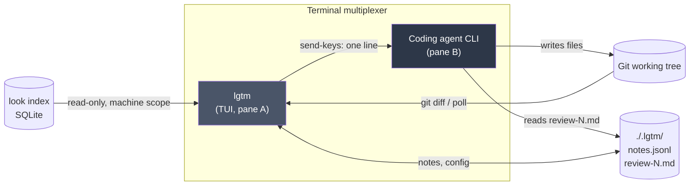
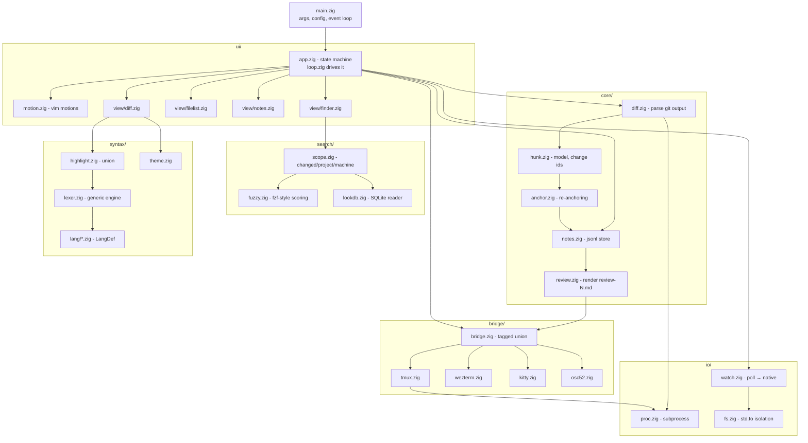
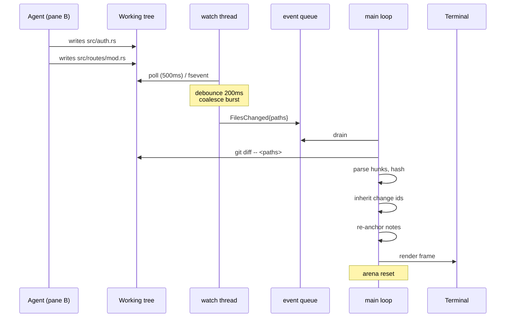
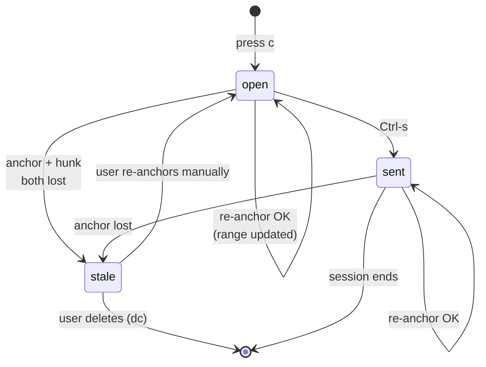

# `lgtm` - Architecture

**Language:** Zig 0.16.0 (pinned)
**Companion doc:** SPEC.md
**Status:** draft v0.1

---

## 1. Shape of the thing

`lgtm` is a single-binary TUI with no daemon, no server, and no background service. It reads three things it does not own - the git working tree, the `look` index, and the terminal - and writes to exactly two places: its own `.lgtm/` directory and the agent's input via the multiplexer.



Two properties fall out of this and are worth protecting:

- **`lgtm` is agent-agnostic.** It never speaks to the agent's API, only to its input box. Any agent that reads files and accepts typed text works, including ones that do not exist yet.
- **`lgtm` is stateless with respect to the repo.** Kill it, restart it, and the only thing you lose is scroll position. All durable state is in `.lgtm/`.

---

## 2. Module graph



**Dependency rule:** `core/` knows nothing about `ui/`, `bridge/`, or the terminal. It is pure data in, data out, and therefore the only part that needs real tests. `ui/` is where correctness is judged by eye.

---

## 3. The main loop

Single-threaded UI, one background thread for watching and indexing. They meet at one mutex-protected queue and nowhere else.



Three rules this diagram encodes:

1. **Debounce lives in the watch thread, not the main loop.** The main loop should never see a burst.
2. **Only changed paths are re-diffed.** `git diff -- <paths>` scales with the agent's edit, not with the repo.
3. **Change-id inheritance runs before re-anchoring**, because anchoring uses `hunk_hash` as its fallback and needs hunks already identified.

**Built with two background threads, not one.** The diagram draws the watcher
alone; `io/input.zig` is a second, because the tty read blocks and the main
loop must stay free to service the watcher. The property this section actually
cares about is intact: the UI is single-threaded, and the threads meet at one
mutex-protected queue and nowhere else. Terminal input is translated to
`core/event.zig` types at the `io/` boundary, so nothing above it knows vaxis
exists.

Resize arrives the same way, as an event, from a winsize handler - **not** by
asking the terminal its size each frame. See 5c for what that cost.

---

## 4. Memory strategy

This is the design decision Zig forces you to make explicitly, so make it once and write it down.

| Lifetime | Allocator | Contents |
|---|---|---|
| Process | `DebugAllocator` (debug) / `page_allocator` wrapper (release) | config, bridge handle, highlighter state, SQLite handle |
| Session | GPA-backed `ArrayList` | notes, change-id table, note anchors |
| **Diff generation** | `ArenaAllocator`, **reset on every re-diff** | hunk structs, diff lines, parsed git output |
| Frame | `ArenaAllocator`, reset every render | formatted strings, highlight spans, layout boxes |

The diff arena is the important one. A re-diff throws away everything about the previous diff, which is exactly what an arena is for: no per-hunk frees, no ownership questions, one `arena.reset(.retain_capacity)` and the whole generation is gone. After a few frames it stops calling the OS entirely.

The catch: **notes must not hold pointers into the diff arena.** Notes outlive diffs. They store owned copies of `anchor_hash`, `body`, and `file`, allocated from the session allocator. Any struct that crosses the arena boundary owns its own bytes. Enforce this by making `Note` contain only `[]const u8` fields allocated from `notes.allocator`, never slices handed over from `diff.zig`.

---

## 5. Highlighting: lexer first, tree-sitter as an escape hatch

`lgtm` needs two things from a language, and neither one needs a parse tree:

1. **Token colouring** - a lexer is sufficient.
2. **Enclosing function name for a hunk header** - a lexer plus brace-depth tracking is sufficient.

A lexer is also a *better* fit here than a parser. A hunk is by definition a fragment: unbalanced braces, functions cut off at both ends. Lexers handle fragments naturally; parsers fall into error recovery, which is their slowest path. tree-sitter's real strength - an accurate tree - is largely wasted on a diff viewer.

**One generic lexer, per-language definitions via comptime:**

```zig
pub const def = lexer.define(.{
    .name = "rust",
    .extensions = &.{"rs"},
    .line_comment = &.{"//"},
    .block_comment = .{ .open = "/*", .close = "*/", .nested = true },
    .strings = &.{
        // Longest opener first: `br#"` before `r#"` before `"`.
        .{ .open = "br", .close = "\"", .escape = null, .multiline = true, .hashed = true },
        .{ .open = "r", .close = "\"", .escape = null, .multiline = true, .hashed = true },
        .{ .open = "\"", .close = "\"", .multiline = true },
        .{ .open = "'", .close = "'", .max_bytes = 12 },
    },
    .keywords = &.{ "fn", "let", "impl", "pub", "match", ... },
    .fn_decl = &.{"fn"},
});
```

**As built.** Four fields the original sketch did not have, each earning its
place against a real file rather than a hypothetical one:

- `max_bytes` - a literal that does not close within N bytes was never a
  literal. This is what stops a Rust lifetime (`'a`) from being read as an
  unterminated char literal and painting the rest of the line as a string.
- `hashed` - `r#"..."#`, where the closing quote only counts with a matching
  `#` count.
- `line_string` - Zig's `\\`, a literal that runs to the end of the line.
- `blocks: .braces | .indent` - Python closes a function span on a column, not
  a brace.

`define()` is where the comptime work happens: the keyword maps, the byte
dispatch tables, and a compile error if a `fn_decl` word was left out of
`keywords`.

Sizes: the per-language estimate held, the engine estimate did not. 33-41
lines per `LangDef` against the ~60 predicted, but 840 lines for the engine
against 200-400, plus 313 for the highlighter and its cache and ~600 of tests.
The engine is comment-dense in the style of the rest of this codebase, so the
gap is smaller in code than in lines - but it is a gap, not a rounding error.

**Pluggable, so the decision stays reversible:**

```zig
pub const Highlighter = union(enum) {
    lexer: Lexer,
    tree_sitter: TreeSitter,   // not built in v0.1
    plain,
};
```

Selected per language *and* per file size. A language with a lexer uses it; anything else falls back to tree-sitter if linked, otherwise `plain`. The user never sees an unhighlighted screen as a failure - it is just a fallback.

**v0.1 ships four lexers: Zig, Rust, Go, Python.** Zero C dependencies for highlighting, nothing to profile.

Zig was written first, against the plan, for one reason: every fixture, every
recorded session and every file in this repository is Zig, so a Rust-first
order would have meant testing the first language definition against no real
code. All four landed in the same phase regardless.

**When tree-sitter earns its place.** Its real value is not speed - it is that *other people maintain 100+ grammars*. What exhausts you writing lexers is not Rust or Go, it is JavaScript (`/` is division or a regex literal depending on context), nested string interpolation, raw strings with arbitrary `#` counts, heredocs. If demand for those languages materialises, link tree-sitter behind the `tree_sitter` variant and vendor only the grammars that need it. Note that tree-sitter has real costs of its own: TypeScript/TSX grammars alone add megabytes of parse tables, running `highlights.scm` over a whole file often costs more than the parse itself (bound it with `ts_query_cursor_set_byte_range`), and half-written files trigger error recovery - the slow path.

**Guard rails, applied to any highlighter:**

- Files over 500 KB or 10k lines → `plain`, no tokenising. Shares the threshold logic with the diff summary path.
- Tokenise only the visible range plus a small margin. **The API takes `(from, to, state)` and one 50-line screen from the nearest checkpoint measures 4.5 us, but nothing calls it that way until the renderer exists.** Whole-file lexing costs 0.57 ms over a 6.4k-line corpus, so this is a convenience the renderer may not need.
- Cache token runs keyed by content hash (LRU, ~32 files). The agent touches six files but usually changes one or two; the rest cost nothing on re-diff. This is the optimisation that matters, not micro-tuning the lexer.
- **The content hash is supplied by the caller, not computed by the cache.** Hashing the file on every lookup made a cache hit cost 5.1 us on a 200 KB input - the same order as the 0.9 ms miss it existed to avoid. `core/diff.zig` already has git's blob hash; that is the key.

---

## 5b. C dependencies

After the lexer-first decision, exactly one remains.

```zig
const c = @cImport({
    @cInclude("sqlite3.h");
});
```

| Library | Use | Linkage |
|---|---|---|
| sqlite3 | read the `look` index | system lib, or vendored amalgamation |

`tree-sitter` is deferred to v0.3+ and only if language demand justifies it.

`libgit2` is deliberately absent. v0.1 shells out to `git`: less linkage, no version skew, and it inherits the user's git config and worktree handling for free. Revisit only if subprocess latency shows up in a profile.

**The `look` index is read through its SQLite file, not through Rust FFI.** The file format is the interface. The cost is a schema coupling between two codebases in two languages - mitigated by reading a `schema_version` row at startup and degrading Machine scope with a clear message if it does not match a known version. Never fail to start because of it.

---

## 5c. The TUI library: libvaxis

Evaluated August 2026. Decision: **libvaxis, low-level API only.** MIT, `minimum_zig_version = "0.16.0"`, main at `0.6.0`.

It is chosen on fit, not just availability. Four requirements from PERFORMANCE.md land directly on library behaviour, and libvaxis satisfies each without a workaround:

| Requirement | What libvaxis provides |
|---|---|
| Full cell control, no widget framework (§7.3) | `Window.writeCell(col, row, cell)`, `child()` for clipped sub-regions, `fill`, `clear`, `scroll`. The `vxfw` Flutter-style layer is a separate opt-in import |
| Damage tracking (§7.1) | Internal `screen` / `screen_last` double buffer; `render()` emits escape sequences only for changed cells, tracks SGR state to avoid redundant codes, and wraps each frame in synchronized output (BSU/ESU) so partial frames never show |
| One buffered flush per frame (§7.4) | `render(self: *Vaxis, tty: *std.Io.Writer)` takes a **caller-supplied** writer and flushes once at the end. We own the buffer and its size |
| We drive the event loop (§3) | Vaxis parses input bytes and returns events; it does not own the loop. Fits the watch thread plus `Event` queue design |

Also relevant: `gwidth()` for grapheme width (correct rendering of source containing CJK or emoji), synchronized output to prevent tearing, OSC 52 already implemented, and capability detection via terminal queries rather than terminfo.

**Redraw-everything is a convention, not a requirement.** `render()` does not clear `self.screen`; the cell buffer persists between frames, and `window()` / `child()` are offset views into it. So there are two valid strategies and we can mix them: over-draw freely and let the internal diff absorb it, or touch only dirty rows and leave the rest of the buffer alone. `queueRefresh()` forces a full repaint when needed (theme change, resize).

Either way the *terminal output* stays minimal; what the diff cannot recover is the *app-side* cost of regenerating content. That is why `lex_cache` and `layout_cache` (§7.2) and lazy layout (§7.5) are load-bearing rather than optional: they make regeneration cheap enough that the choice above stops mattering inside an 8 ms keystroke budget. Do not hand-roll row-level dirty tracking before `--profile` says the caches are insufficient.

**Pin to a main-branch commit hash, not a release tag.** This is the one piece of operational hygiene that matters. The most recent tag is **v0.5.1, November 2024** - close to two years of active development lives only on `main`, including the entire Zig 0.16 port. Tags are not a usable channel here. v0.5.0 also announced deliberate breaking changes (removing deprecated items, `window.child` width/height moving from union to optional, narrowing `usize` to `u16`), so floating is not an option either. Reference point at evaluation time: `c060d314930c5552b99a89278a6a695baf0352da` (2026-08-20).

**If upstream churn ever blocks us, fork and pin the fork.** This is the established pattern in this ecosystem, not an exotic escape hatch: Flow Control (the largest libvaxis application) depends on `neurocyte/libvaxis` at a pinned commit rather than upstream. MIT licensing makes it free to do. Prefer upstream; keep this in reserve.

**Two costs accepted:**

- `zigimg` is a **non-lazy** dependency of vaxis, present for the kitty graphics protocol that `lgtm` never uses. It is fetched and compiled on every build. Zig's lazy analysis should keep it out of the final binary - confirm rather than trust, since binary size is the budget it threatens. **Confirmed at phase 5a: zero `zigimg` symbols in the binary.** This half of the bet held.
- `uucode` (Unicode 17, comptime-embedded 3-stage lookup tables) is lazy and requests only four fields: `east_asian_width`, `grapheme_break`, `general_category`, `is_emoji_presentation`. Because the tables are embedded at compile time there is **no runtime load, so this is a binary-size cost and not a cold-start or RSS cost.** A `-Dexternal_uucode` option exists to share one instance if anything else ever pulls uucode in. For scale: `zide`, a libvaxis editor that also links tree-sitter, ships under 1 MB static.

  **This half of the bet did not hold, and phase 5a is when it came due.** The
  tables stayed out of the binary only while nothing called into them. The
  renderer calls `Window.gwidth()` - which it must, because right-aligning a
  status field full of multi-byte glyphs cannot assume one byte is one column -
  and that pulls in **185 KB** of tables. Stripped binary is now 957 KB against
  a 1 MB budget, with themes, help, config, notes, the finder and the bridge
  still to come.

  Also present and so far unexamined: `std.compress.flate` and the DWARF
  self-unwinder, dragged in by Zig's default panic handler so it can symbolise
  its own stack traces.

  A lever has to be chosen before 5c: `-Dexternal_uucode`, a `ReleaseSmall`
  distribution build, a narrower panic handler, or raising the budget with a
  stated reason. Note also that phase 0's 653 KB was macOS arm64, where debug
  info lives in a separate `.dSYM` - that figure and this one were never
  measuring the same thing, and only stripped-to-stripped is a fair comparison.

**Do not call `resize()` to find out whether you need to.** Phase 5a asked the
terminal its size every frame and resized unconditionally, on the assumption
that a no-op resize was free. It is not: `resize` reallocates both screen
buffers, and one of them is `screen_last`, the damage-tracking baseline. The
result was a full repaint per keystroke - 3949 bytes on the wire instead of
248, and a visible flicker. Resize on the resize event, and only then.

This is the same class of mistake as the one below: an API whose cost is not
where its name suggests. Both were found by looking at the terminal, not at a
profile.

**Cells reference your text; they do not copy it.** Found the hard way in the walking skeleton: rows built from string literals rendered correctly while a row built into a stack buffer rendered as garbage, because the buffer died before `render()` ran. `printSegment` stores the slice you hand it, and `render()` reads it later.

This is load-bearing for the diff view, where almost every row is generated (line numbers, gutter markers, expanded tabs) rather than literal. Two consequences, both non-negotiable:

- Per-frame row text is allocated from the **frame arena**, and that arena is reset **after** `render()` and its flush, never before. The ordering in §4 is not stylistic.
- Nothing handed to `printSegment` may live in a scope that closes before the render call.

A dangling slice here does not crash. It renders plausible-looking garbage on one row, which is a far worse failure mode, so treat this as a review checklist item rather than something the compiler will catch.

**Boundary rule, from §7.** `render()` accepts a `*std.Io.Writer`, so vaxis's API surface pulls `std.Io` types toward the UI. Rule 5 quarantines `std.fs` and `std.process` specifically, so this is not a violation - but the spirit of that rule is insulating against `std.Io` churn, which is where the 0.16 cycle moved things. Therefore: **the tty writer is constructed in `io/`, and `ui/` receives it as a parameter.** No writer construction in `ui/`.

**Alternatives surveyed (August 2026).** Nothing else combines cell-level control, damage tracking, and a maintained Zig 0.16 build:

| Candidate | Verdict |
|---|---|
| `mibu` | Alive on 0.16, but escape codes and input only - no screen model, no damage tracking. We would build the cell buffer ourselves |
| `ansi_term` (ziglibs) | Alive on 0.16; style and escape formatting only, not a TUI library |
| `zigzag` | New Elm/Bubble Tea-style framework on 0.16, ~528 stars. Model-Update-View is the wrong shape for a custom diff renderer, and it is young |
| `TUI.zig` | Claims double buffering on 0.16, but ~11 commits. Too early to bet on |
| `zig-spoon` / `zig-spork` | Dormant since roughly Zig 0.10 (2023). Upstream also relocated to GPL, which conflicts with Apache-2.0 |
| `zbox`, `zig-termbox` | Dead or unmaintained; no 0.16 support |
| `termbox2`, `ncurses`, `notcurses` bindings | All reintroduce the C dependency §5b just eliminated. Notably, Flow's author moved *off* notcurses onto libvaxis |
| `opentui` | Zig core exists but is packaged for TypeScript bindings, not standalone Zig consumption |

**Maintenance signal.** Real applications depend on it: Flow Control (a text editor on Zig 0.16), `comlink` (the maintainer's own IRC client, packaged in AUR), and `zide`. There is also active performance work upstream - grapheme-width caching, an ASCII fast path in the parser, SIMD scanning, with a `zig build bench` harness. No performance complaints surfaced in the survey.

Known rough edges, none blocking: `src/widgets` has bitrotted and is excluded from tests, and some examples lag the core. We use neither. Revisit this decision only if libvaxis stops tracking Zig releases.

---

## 6. The bridge interface

Runtime-selected backends, so this is a tagged union rather than comptime dispatch:

```zig
pub const Bridge = union(enum) {
    tmux: Tmux,
    wezterm: WezTerm,
    kitty: Kitty,
    zellij: Zellij,
    osc52: Osc52,

    pub fn sendText(self: *Bridge, text: []const u8) BridgeError!void { ... }
    pub fn listTargets(self: *Bridge, a: Allocator) BridgeError![]Target { ... }
};

pub fn detect(a: Allocator) Bridge { ... }  // env vars, falls back to .osc52
```

`detect()` never returns an error - OSC 52 is always reachable, so there is always a working bridge. Backend failures degrade to OSC 52 at call time with a status-line notice, and never propagate as fatal.

Two invariants enforced in `bridge.zig` rather than in each backend, so no backend can get them wrong:

- `sendText` **rejects any payload containing `\n`.** This is a compile-time-documented, runtime-asserted rule. Review submission goes through `review.zig`, which writes a file and hands the bridge a single line.
- Payloads end with a trailing space and never include a carriage return.

---

## 7. Living with pre-1.0 Zig

0.16.0 shipped 2026-04-14; 0.17 is in development. The 0.16 cycle moved filesystem, process, and randomness APIs into `std.Io`, and that churn will continue. Two concrete defenses:

**Pin the compiler.** `minimum_zig_version` in `build.zig.zon`, plus a `.zigversion` file for `zvm`/`zigup`. Upgrade deliberately, on a branch, never mid-feature.

**Quarantine `std.Io`.** All filesystem and subprocess calls go through `io/fs.zig` and `io/proc.zig`; the render writer goes through `io/tty.zig`. Nothing else imports these APIs directly. When the next release rearranges them, the fix is three files rather than forty.

**This rule already paid for itself, on day one.** 0.16 did not merely rearrange `std.fs`, it emptied it. Confirmed against the shipping compiler while scaffolding:

| Pre-0.16 | Zig 0.16 |
|---|---|
| `std.fs.File`, `std.fs.Dir` | `std.Io.File`, `std.Io.Dir` (`std.fs` retains only `path` and base64 aliases) |
| `std.Thread.Mutex`, `std.Thread.Condition` | `std.Io.Mutex`, `std.Io.Condition`, and their methods now take an `Io` |
| `std.time.nanoTimestamp()` | `std.Io.Timestamp.now(io, clock)`; `std.time` is constants only |
| `Child.Term.Exited` | `Child.Term.exited` (tags lowercased) |
| `fn main()` obtains its own allocator | `fn main(init: std.process.Init)` receives `gpa`, `io`, `arena`, `args`, `environ_map` |

The practical consequence is broader than the original wording: **`Io` is now a value that must be threaded through**, like `Allocator`. Anything that reads a clock, locks a mutex, or touches a file needs one. Where threading it to every call site would be noise, capture it once at startup (`io/metrics.zig` does this) rather than reaching for a global in each module.

**Vendor, don't float.** C grammars and any Zig dependency (libvaxis) get pinned by hash in `build.zig.zon`. A tool whose whole pitch is "it starts instantly and never breaks" cannot have a build that breaks on someone else's push.

**Vendor, don't float.** C grammars and any Zig dependency (libvaxis) get pinned by hash in `build.zig.zon`. A tool whose whole pitch is "it starts instantly and never breaks" cannot have a build that breaks on someone else's push.

---

## 8. Note lifecycle



`stale` is a visible state, never a silent deletion. It appears in a separate section of the notes panel (`C`) with the original body and the last known location, so the user can decide. Losing a note the user typed is the class of bug that makes people stop trusting a tool.

---

## 9. Build layout

```
lgtm/
├── build.zig
├── build.zig.zon          # pinned deps + minimum_zig_version
├── .zigversion
├── src/
│   ├── main.zig
│   ├── config.zig         # what a setting means, and what a bad one costs
│   ├── toml.zig           # the subset config.zig reads it from
│   ├── text/              # buffer + TextEdit - see §11
│   │   ├── buffer.zig
│   │   └── edit.zig
│   ├── core/              # pure logic, unit-tested
│   │   ├── diff.zig
│   │   ├── hunk.zig
│   │   ├── linemap.zig    # matching two versions line to line
│   │   ├── anchor.zig     # the tiers built on it: mapped, hashed, stale
│   │   ├── notes.zig
│   │   └── review.zig
│   ├── io/                # std.Io quarantine
│   │   ├── fs.zig
│   │   ├── proc.zig
│   │   └── watch.zig
│   ├── ui/
│   │   ├── loop.zig       # the run loop: terminal, threads, $EDITOR handover
│   │   ├── app.zig        # state, command dispatch, motions
│   │   ├── review.zig     # one diff generation: git, buffers, ids, lex cache
│   │   ├── rows.zig       # the row model, vaxis-free and headless-testable
│   │   ├── frame.zig      # what a frame is drawn onto, and from
│   │   ├── render.zig     # the chrome, and the order things are drawn in
│   │   ├── body.zig       # the diff itself, one screen row at a time
│   │   ├── popup.zig      # the `?` overlay: geometry, then drawing
│   │   ├── keymap.zig     # what keys mean: bindings, matcher, conflicts
│   │   ├── keytext.zig    # how keys are written: chords, hints, help rows
│   │   ├── help.zig       # the `?` overlay's filter and selection
│   │   ├── prompt.zig     # the `/` and `:` input line
│   │   ├── search.zig     # matching across the whole review
│   │   ├── editor.zig     # $EDITOR argv, from $VISUAL/$EDITOR
│   │   ├── palette.zig    # the seven bundled palettes, as data
│   │   ├── theme.zig      # the mapping onto semantic slots, and `[theme]`
│   │   └── preview.zig    # --theme-preview
│   ├── bridge/
│   ├── search/
│   └── syntax/
│       ├── token.zig      # what a lexer produces: kinds and runs
│       ├── langdef.zig    # the vocabulary a language is described in
│       ├── lexer.zig      # one pass: classify and track structure together
│       ├── highlight.zig
│       └── lang/          # zig.zig, rust.zig, go.zig, python.zig
└── tests/
    └── fixtures/          # recorded git diff output + edit sequences
```

---

## 10. Build order

The dependency graph suggests a different order than the roadmap does, and the graph wins.

1. **`core/anchor.zig` first, standalone, before any TUI exists.** Write a harness that replays recorded edit sequences from `tests/fixtures/` and reports the re-anchor hit rate. If it lands below ~90%, the entire review-notes feature needs redesigning - and finding that out with 300 lines of code is far cheaper than finding it out with a finished TUI attached.
2. `core/diff.zig` + `hunk.zig` - parse `git diff`, assign and inherit change ids. Also testable headless.
3. `io/watch.zig` polling version. Fifty lines. Native backends much later.
4. `syntax/lexer.zig` + Zig - pure function from bytes to token spans. Headless-testable, and now cheap enough to belong in v0.1. Zig rather than Rust, because it is the only language there was real recorded input for.
5. `ui/` with libvaxis - unified diff only, at 80 columns. Split in practice into the loop plus a rendered diff, then motions, then chrome; the integration risk is all in the first slice.
6. `bridge/tmux.zig` + `osc52.zig`.

Steps 1–4 are pure Zig with no terminal involved, which means they are the parts you can actually test. Do them while the design is still cheap to change.

---

## 11. Designing for editing and LSP

Editing and LSP are explicit non-goals for v1 (SPEC.md §4). This section is about making them **cheap to add later**, not about adding them. The distinction matters: a structure that accommodates a feature is not permission to build it, and "we already designed for it" is the most common excuse for scope creep.

Four decisions, all of which cost roughly a day at v0.1 and a rewrite if deferred.

### 11.1 The buffer is the source of truth; the diff is an overlay

The single decision that determines everything else. If `lgtm` treats `git diff` output as its primary data, adding editing later means a rewrite - editing needs a mutable buffer, and diff text is not mutable.

```zig
// text/buffer.zig
pub const Buffer = struct {
    lines: [][]const u8,
    // v0.1: read-only. apply() exists and returns error.NotImplemented.
    pub fn line(self: *Buffer, n: usize) []const u8 { ... }
    pub fn apply(self: *Buffer, e: TextEdit) !void { ... }
};
```

The diff view renders from **two buffers** - the HEAD version and the working-tree version - with hunks as annotations pointing into them, rather than rendering a diff string. Cost at v0.1: mapping hunks to line ranges instead of printing git's output verbatim. In exchange, editing later is *additive* rather than surgical.

### 11.2 `TextEdit` is the only way text changes

```zig
pub const TextEdit = struct { range: Range, new_text: []const u8 };
```

This is not speculative future-proofing. **Revert-a-hunk in v0.3 is already a `TextEdit`**, and so is stage/unstage. User edits, LSP code actions, and undo all arrive as the same type later. One application path means one place where invariants live: notes re-anchor, the diff invalidates, the buffer version increments.

### 11.3 Positions are bytes internally; UTF-16 conversion happens at exactly one boundary

The classic LSP trap: LSP counts columns in **UTF-16 code units**, not bytes or codepoints. If byte offsets leak into structures that later talk to a language server, you audit every call site.

Rule, written down now and enforced by review: **byte offsets everywhere internally; convert only in `lsp/position.zig`.** That file does not need to exist yet. The rule does.

### 11.4 Enumerate modes and events now, populate them later

```zig
pub const Mode = enum { normal, visual, note_input, finder, insert, command };
```

v0.1 uses the first three. Declaring all six costs nothing; writing `if (in_visual_mode)` across the codebase makes adding insert mode a full dispatch refactor.

Same argument for the event queue. It already exists for the watch thread - make it a general union rather than a `FilesChanged` channel:

```zig
pub const Event = union(enum) {
    key: Key,
    files_changed: []const []const u8,
    resize: Size,
    // later: lsp_response, agent_edit (ACP), task_done
};
```

LSP is asynchronous JSON-RPC and needs exactly this infrastructure. So does the ACP path in SPEC.md §8.

### 11.5 What this changes in the layout

```
src/
├── text/              # new, v0.1
│   ├── buffer.zig
│   ├── edit.zig       # TextEdit, Range, Position
│   └── rope.zig       # not in v0.1 - Buffer swaps in later if needed
├── core/
├── io/
└── lsp/               # empty until v0.3+, but the boundary is named
    └── position.zig   # the only UTF-16 conversion site
```

`rope.zig` is listed to make the intent explicit: `Buffer` starts as a line array because v0.1 never mutates it. If editing arrives and line-array edits prove too slow, a rope slots in behind the same interface. Do not build it early.

---

## 12. Open architectural questions

1. **Subprocess vs libgit2** - start with subprocess. Revisit only if a profile says so.
2. **When does tree-sitter get linked?** Not on performance grounds - on language-coverage grounds. Trigger: users asking for JS/TS, or a lexer for a context-sensitive language taking more than a day. Until then the `tree_sitter` variant stays unimplemented.
3. **Note storage format** - `jsonl` is append-friendly and greppable, but rewriting on delete is awkward. Acceptable at expected volume (tens of notes). Revisit only if it hurts.
4. **Windows** - `ReadDirectoryChangesW` and the absence of tmux mean the bridge story there is OSC 52 only. Is Windows a v1.0 target at all, or a later port?
5. ~~**Where does the enclosing-function scan run?**~~ **Answered.** Over the whole file, eagerly, on the main thread, per changed file - cached per content hash alongside the token runs. Measured on the 5k-line file this asked for: 0.5 ms for 6.4k lines, against a 100 ms re-diff budget. Neither of the escape hatches is needed, and restricting the scan to the visible range would cost the correct brace depth it exists to produce.
